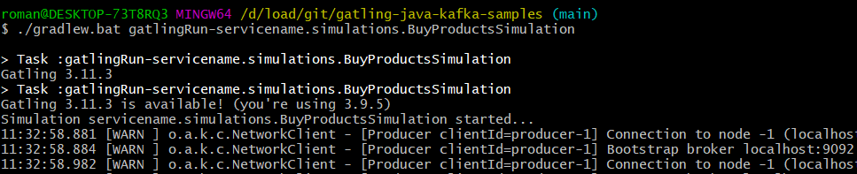

# gatling-java-mq-samples

Examples of gatling load tests for kafka protocol

Примеры скриптов для Kafka.

# Documentation

Возможно, вам будет удобно поддерживать документацию по скриптам в стиле JavaDoc.

Это может выглядеть примерно так:

- [JavaDoc](https://htmlpreview.github.io/?https://github.com/Roman-Kislyy/gatling-java-kafka-samples/blob/main/docs/javadoc/index.html)

# Небольшие инструкции по работе с Gatling и Gradle:

- [Как запустить тест при помощи Gradle](docs/how-to-slides/Gtg-How-to-start-test.pptx)
- [Какие бывают переменные в Gatling](docs/how-to-slides/Gtg-Variables.pptx)
- [Про разные сценарии нагрузки. Максимум, стресс и другое](docs/how-to-slides/Gtg-Scenario-injections-load-users.pptx)
- [О структуре скриптов на Gatling. Термины для начинающих](docs/how-to-slides/Gtg-Termins-script-structure.pptx)
 
# Быстрый старт

Как запустить тест при помощи Gradle plugin.

`./gradlew.bat gatlingRun-servicename.simulations.BuyProductsSimulation`

или 

`gradlew.bat gatlingRun-servicename.simulations.BuyProductsSimulation`

В зависимости от окружения.

